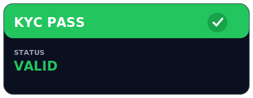

# RWA-MVP

一个基于 Solidity + Foundry 的「现实世界资产（Real-World Asset, RWA）」托管与份额发行最小可行产品（MVP）。

项目完整演示了链上端到端流程：

1. **KYC 通行证** (`KycPassNFT`) —— Soul-Bound ERC-721，充当合规闸门；
2. **USDC 金库** (`SimpleRwVault`) —— 1:1 申购 / 赎回；
3. **份额代币** (`VaultToken`) —— 与托管资产精确对应的 ERC-20；
4. **脚本 & 测试 & Makefile** —— 一键部署 / 调试 / CI。

---

## 功能概览

| 合约 | 关键职责 | 核心特性 |
| ---- | -------- | -------- |
| `KycPassNFT` | 给通过 KYC 的地址签发 / 吊销「通行证」 | • Soul-Bound：禁止用户转让<br>• 轻量链上元数据（等级 / 国别 / 到期）<br>• `hasValidPass` 供外部合约快速校验<br>• **兼容 ERC-721 钱包展示** |
| `VaultToken` | 表征金库份额的 ERC-20 | • 仅金库地址可 `mint` / `burn`<br>• `decimals` 与资产一致 (USDC = 6)<br>• 一次性 `setVault` 绑定 |
| `SimpleRwVault` | 托管 USDC，按 1:1 映射 `VaultToken` | • KYC Gate — 仅持证用户可申购<br>• `deposit` / `withdraw` 保持 `totalAssets == totalShares`<br>• `min/maxDeposit`、`Pausable`、`ReentrancyGuard`<br>• 信息披露链接 `reportURI` |

> 📱 **钱包可见**：由于遵循 ERC-721 标准，通行证可以直接在 MetaMask、Rainbow 等支持 NFT 的钱包里查看；SVG 元数据在链上实时生成。

### 通行证示意图




---

## 未来可优化方向

1. **资产多样化** – 支持 ETH / 多币种仓位，加入价格预言机与净值 (NAV)。
2. **收益策略** – 集成收益协议，自动复投；管理费 / 绩效费收取。
3. **治理与升级** – Time-lock、DAO 治理，UUPS / Beacon 升级。
4. **透明度** – 链下审计报告哈希上链；Subgraph、Dune Dashboard。
5. **前端 / SDK** – React + wagmi 快速接入；TypeScript SDK。

---

## Quick Start

> ⚙️ 依赖：`foundryup` · `git` · `make`

### 1⃣ 克隆仓库 & 查看命令

```bash
# 克隆
git clone https://github.com/your-org/RWA-MVP.git
cd RWA-MVP

# 查看所有快捷命令
make help
```

### 2⃣ 安装依赖

```bash
make install      # 安装 forge-std / OpenZeppelin / foundry-devops
```

### 3⃣ 启动本地链 & 一键部署

```bash
# 启动 Anvil（固定助记词，12s 出块）
make anvil

# 将所有合约部署到本地链
make deploy-anvil
```

> 📌 **环境变量** — 建议在仓库根目录新建 `.env`，Makefile 会自动读取：
>
> ```ini
> ANVIL_RPC_URL=http://127.0.0.1:8545
> ANVIL_PRIVATE_KEY=...
> SEPOLIA_RPC_URL=https://sepolia.infura.io/v3/...
> SEPOLIA_PRIVATE_KEY=...
> ETHERSCAN_API_KEY=...
> ```

### 4⃣ 运行测试

```bash
make test         # forge test -vvv
# 跑单个用例：make test-<TestName>
```

---

## 目录结构

```
src/                 合约源码
└─ interfaces/       IKycPassNFT / IVaultToken / ISimpleRwVault
spec/                中文设计文档
script/              Foundry Script 部署 & 演示
broadcast/           forge script 生成的链上交易 JSON
lib/                 forge-std / openzeppelin-contracts / foundry-devops
test/                Solidity 单测
Makefile             快捷命令入口
foundry.toml         Foundry 配置
```

---

## 许可

[MIT](./LICENSE)（合约及脚本）
